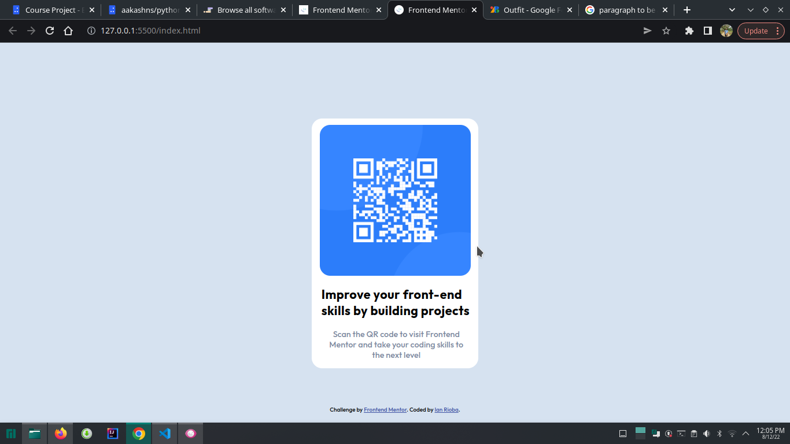
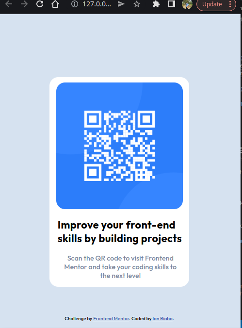

# Frontend Mentor - QR code component solution

This is a solution to the [QR code component challenge on Frontend Mentor](https://www.frontendmentor.io/challenges/qr-code-component-iux_sIO_H). Frontend Mentor challenges help you improve your coding skills by building realistic projects. 

## Table of contents
  - [Screenshot](#screenshot)
  - [Links](#links)
- [Frontend Mentor - QR code component solution](#frontend-mentor---qr-code-component-solution)
  - [Table of contents](#table-of-contents)
    - [Screenshot](#screenshot)
    - [Links](#links)
  - [My process](#my-process)
    - [Built with](#built-with)
    - [What I learned](#what-i-learned)
    - [Continued development](#continued-development)
  - [Author](#author)


### Screenshot




### Links

- Solution URL: [Add solution URL here](https://www.frontendmentor.io/solutions/qr-code-component-solution-using-html-and-css-DrlgjwuE3v)
- Live Site URL: [Add live site URL here](https://rioba-ian.github.io/qr-code-component-main/)

## My process

### Built with

- Semantic HTML5 markup
- CSS custom properties
- Flexbox
- [Styled Components](https://styled-components.com/) - For styles
### What I learned

The css part of using semantic tags instead of normal divs gave me an awakening. I've used main, article. 

Styling the footer with top and position absolute was a new part I learnt in this challenge. I honestly feel it was quite easy except for styling which took longer than I imagined. 

```css
.attribution {
    /* font-size: 11px;
    text-align: center; */
    position: absolute;
    bottom: 0;
    width: 100%;
    height: 2rem;

}
```
Oh, btw another important part was 

```css
p {
  text-align: center
}
```


### Continued development

The areas I want to focus in future development are:

1. Sass
2. Javascript
3. Typescript


## Author

- Website - [Rioba-Ian](https://github.com/Rioba-Ian)
- Frontend Mentor - [Rioba-ian](https://www.frontendmentor.io/profile/Rioba-Ian)
- Twitter - [@rioba_riri](https://twitter.com/rioba_riri)


